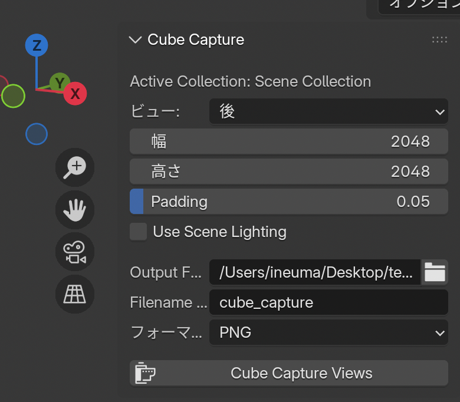
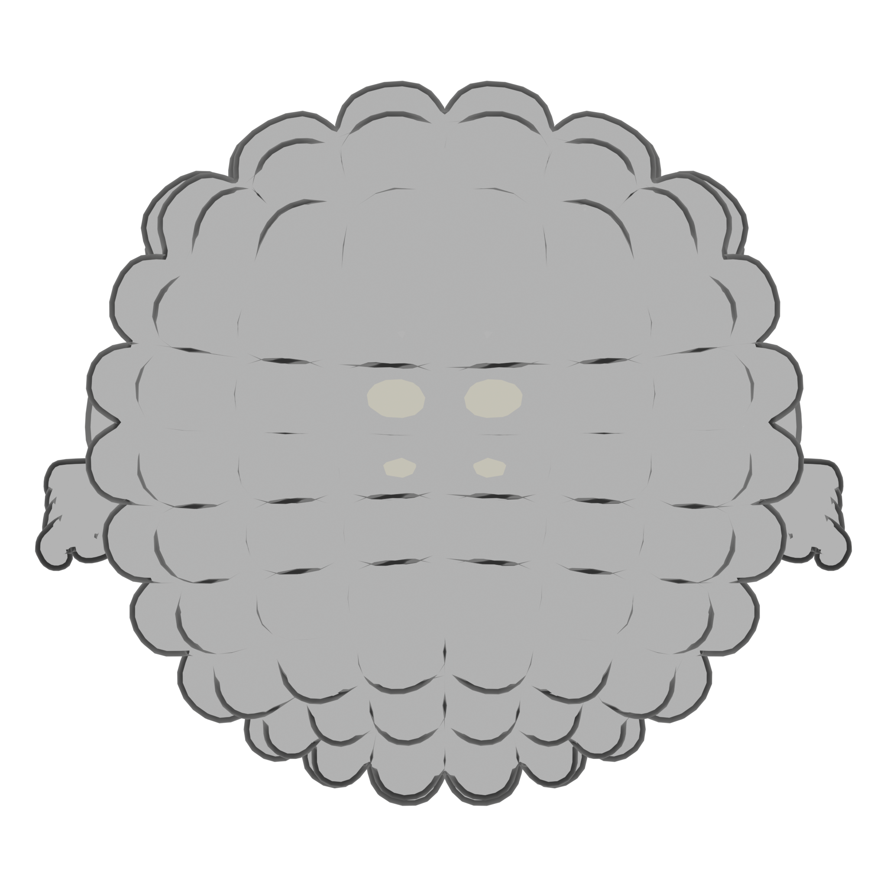
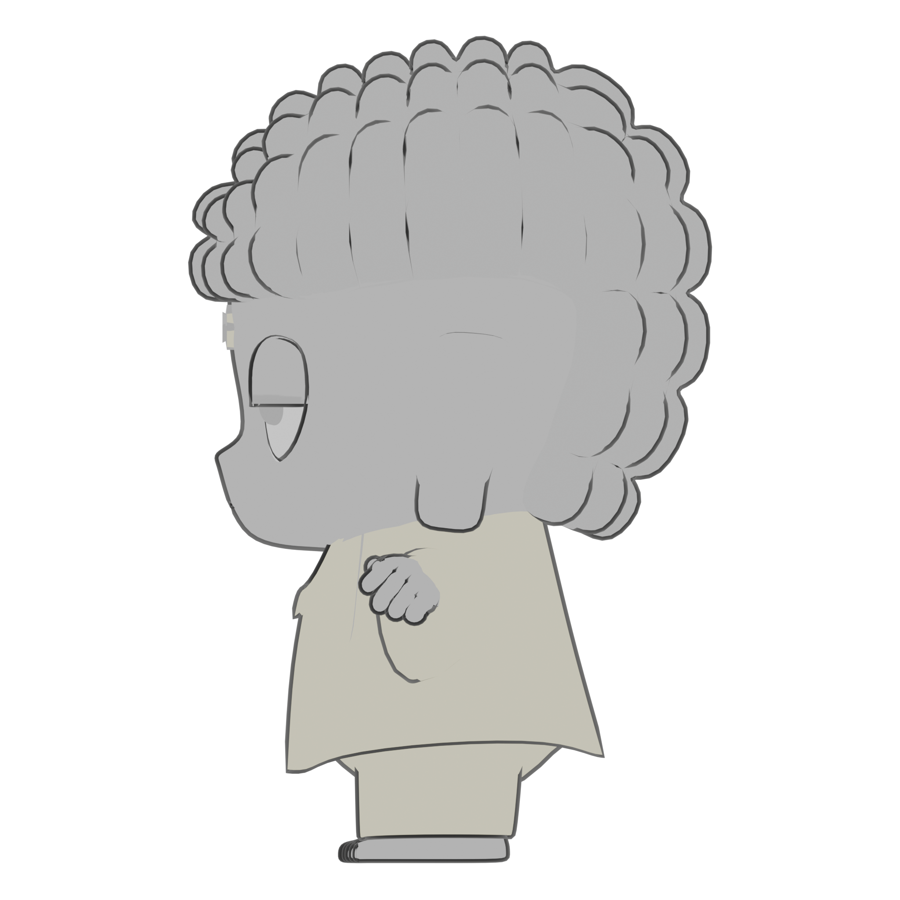

# Cube Capture

cube-capture is a lightweight Blender addon that lets you easily capture six orthogonal views of your scene (front, back, left, right, top, bottom) and save them as images.
It’s ideal for creating 3-view reference sheets, quick modeling guides, or generating cube maps for environment textures.

## Usage

You can find the addon panel in the **N Panel (Sidebar)** under the "Cube Capture" tab.

## ScreenShot Sample

| Top View                                  | Right View                                  |
| ----------------------------------------- | ------------------------------------------- |
|  |  |
